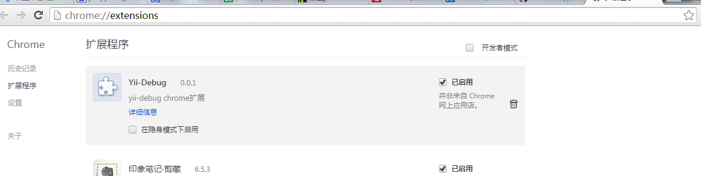

# yii2-debug chrome 扩展

有时候，因为调试需要，我们不能够在服务器端控制 `YII_DEBUG` 参数来控制显示和隐藏 yii-debug-toolbar。

因为这个参数会导致所有的用户都能够看到下面的 toolbar，这个时候，如果我们有调试需求的时候，就非常苦恼了。

这里，我对 yii2-debug 模块稍微做了修改，配合这个 chrome 扩展，我们可以在浏览器端通过扩展的启用/禁用以实现 toolbar 的显示/隐藏。

# 使用方法

* 打开 chrome 扩展标签页。（地址栏输入chrome://extensions/）
* 将 chrome.crx 拖曳到扩展标签页以安装。



* 将 yii2-debug 目录里面的内容拷贝到你项目的 yii2-debug 的安装目录并覆盖。如果是从 yii 官方提供的模板项目生成的项目，应该位于 `vendor/yiisoft/yii2-debug` 。
* 确认你的站点的配置文件加载了 yii2-debug 模块，即配置文件  `web.php/web-local.php/main.php/main-local.php` 里面有类似如下的配置。（建议将 yii2-debug 的加载配置放在通过 YII_DEBUG 开关控制的分支里面。这样，你就可以在生产环境禁用这个开关以避免性能损失，同时在需要调试的时候启用此开关。）

```php
	if (YII_DEBUG) {
	    // configuration adjustments for 'dev' environment
	    $config['bootstrap'][] = 'debug';
	    $config['modules']['debug'] = 'yii\debug\Module';
	}
```

* 访问你的站点 URL ，现在，你可以在浏览器端通过启用/禁用扩展以控制 yii-debug-toolbar 的显示隐藏。

>注意：扩展只是控制 yii-debug-toolbar 的显示隐藏，一切的前提是你站点开启了 yii2-debug 模块。如果没有启用 yii2-debug 模块，这里的启用禁用也是无效的。

